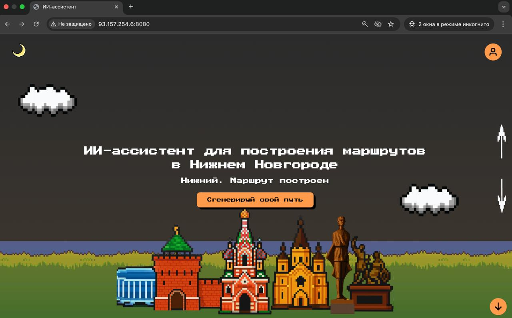
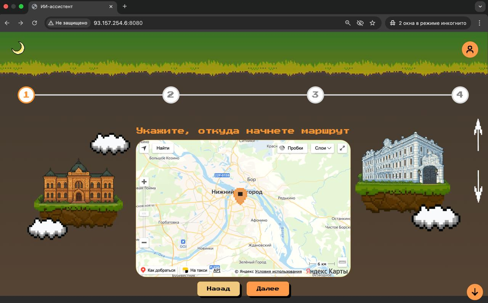
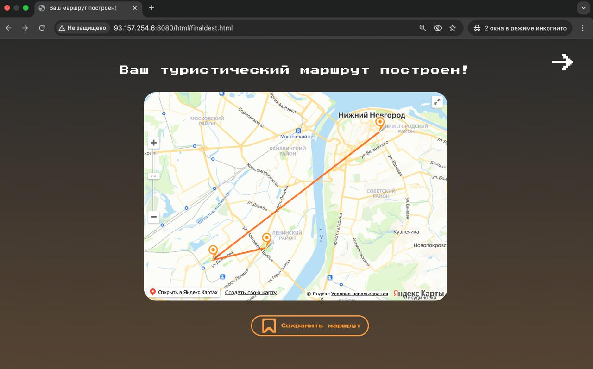

# 🚶‍♂️ Туристический сервис по Нижнему Новгороду

Сервис для создания персонализированных пешеходных маршрутов по Нижнему Новгороду на основе ваших предпочтений. 🌆

## 📌 Описание

Пользователь указывает:

- **⏳ Время прогулки** 
- **🎯 Пожелания** (например: «исторические здания», «парки», «виды на Волгу»)  
- **📍 Точку начала маршрута** на карте

Сервис генерирует оптимальный маршрут с учётом всех параметров! 🗺️✨

## 🌟 Возможности

- 🔄 Генерация маршрутов в реальном времени  
- 🏛️🌿📸 Поддержка разных интересов: архитектура, природа, музеи, фото-зоны и др.  
- 🗺️ Отображение маршрута на интерактивной карте  
- 💾📤 Возможность сохранить маршрут

## 📸 Скриншоты

<!-- Добавьте изображения здесь -->

## ⚙️ Технологии

- **Frontend**: HTML+CSS+JS
- **Backend**: Python / Go / ML
- **База данных**: PostgreSQL 🐘 
